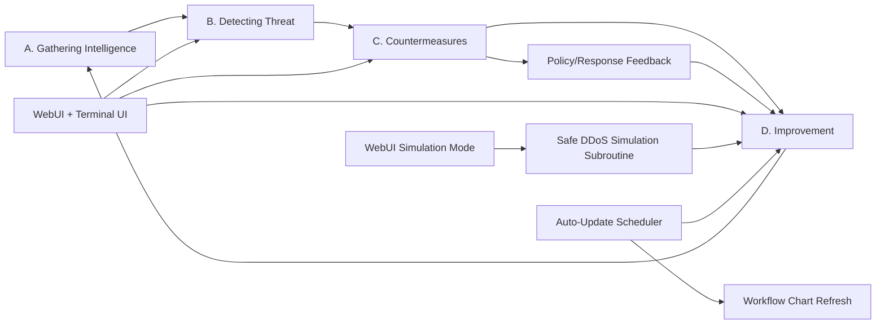

# SecIDS-CNN Workflow Chart (Auto-Updated)

**Generated:** 2026-03-10 19:11:47 UTC
**Source:** `Auto_Update/monitors/update_workflow_chart.py`
**Privilege Baseline:** `Master-Manual.md`

## Operational Flow

## Stage Ownership

- **A. Gathering Intelligence:** Live packet capture and data ingestion
- **B. Detecting Threat:** Flow feature extraction + model inference
- **C. Countermeasures:** Policy decision + active/passive response
- **D. Improvement:** Feedback persistence + retraining + model refresh

## Integrity Snapshot

| Tracked File | Status | Fingerprint |
|---|---|---|
| `Root/integrated_workflow.py` | ✅ Present | `c1e3831f257c` |
| `Tools/simulate_ddos_workflow.py` | ✅ Present | `2f38e0ccbdf5` |
| `WebUI/app.py` | ✅ Present | `874c75cc965f` |
| `WebUI/menu_actions.py` | ✅ Present | `2953e974e767` |
| `WebUI/templates/index.html` | ✅ Present | `db792bad872e` |
| `WebUI/static/app.js` | ✅ Present | `19cad01c9af9` |
| `WebUI/static/style.css` | ✅ Present | `e026accc03ad` |
| `SecIDS-CNN/train_and_test.py` | ✅ Present | `9128b9ec1782` |
| `Auto_Update/task_scheduler.py` | ✅ Present | `36b8ea33be48` |
| `Auto_Update/schedulers/task_config.json` | ✅ Present | `061643742f5b` |

## Notes

- This chart is automatically updated by Auto-Update task `workflow_chart_update`.
- It is intended to stay aligned with the live workflow implementation and scheduler config.
